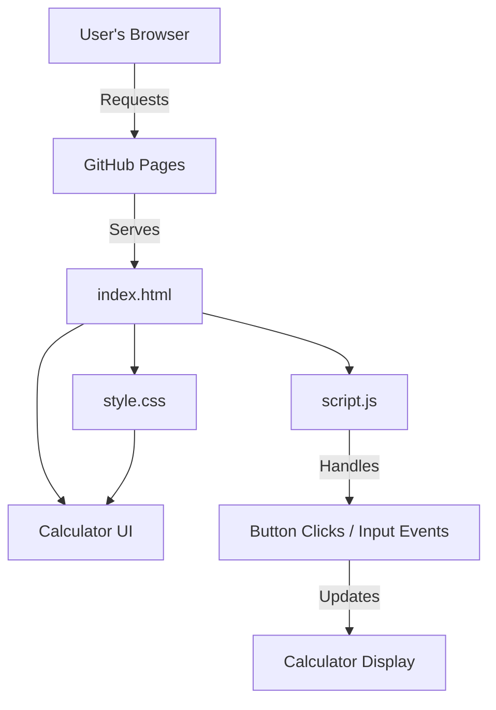

# 🧮 Calculator Web App

A sleek, responsive calculator built with **HTML**, **CSS**, and **JavaScript**. Perform basic arithmetic operations (addition, subtraction, multiplication, division) with a modern UI and smooth experience—no frameworks, no build tools, just pure front-end code!

[**🌐 Live Demo → sinha-19.github.io/Calculator/**](https://sinha-19.github.io/Calculator/)

---

## 🗺️ Workflow Diagram



---

## 📁 Project Structure

```
Calculator/
├── index.html      # Main HTML file for the calculator interface
├── style.css       # CSS for layout, colors, and responsiveness
├── script.js       # Handles all calculator logic and interactivity
├── .vscode/        # VSCode settings (optional, dev only)
```

---

## ✨ Features

- **Basic Operations:** Addition, subtraction, multiplication, division.
- **Keyboard Support:** Use keyboard for numbers and operators.
- **Responsive Design:** Works on desktop, tablet, and mobile.
- **Modern UI:** Clean layout, contrasting buttons, and smooth transitions.
- **Real-time Calculation:** Immediate feedback on input and results.
- **Error Handling:** Displays friendly errors (e.g., divide by zero).
- **No Dependencies:** 100% vanilla JavaScript, CSS, and HTML.

---

## 📝 How It Works

- **index.html:**  
  Lays out calculator structure: display area and buttons for numbers/operators.

- **style.css:**  
  Styles the calculator grid, buttons, display area, and ensures responsiveness for all device sizes.

- **script.js:**  
  - Listens for button and keyboard events.
  - Handles input parsing and expression evaluation.
  - Updates the display in real time.
  - Prevents invalid states (multiple decimals, divide by zero, etc.).

---

## 🌐 Live Demo

> Try the Calculator now:  
> [https://sinha-19.github.io/Calculator/](https://sinha-19.github.io/Calculator/)

---

## 🚀 Getting Started (Local Development)

1. **Clone the repository:**
   ```bash
   git clone https://github.com/sinha-19/Calculator.git
   cd Calculator
   ```

2. **Open `index.html` in your browser:**
   - Double-click the file
   - **OR** run a simple local server:
     ```bash
     npx serve .
     # or
     python -m http.server
     ```

---

## 🛠️ Customization Tips

- **Change Theme:**  
  Edit colors, border-radius, or font in `style.css`.
- **Add Functions:**  
  Extend logic in `script.js` for features like percentage, parentheses, or scientific operations.
- **Change Layout:**  
  Rearrange or add buttons in `index.html`.

---

## 💡 Credits

- **Design & Code:** [Saket Kumar Sinha](https://github.com/sinha-19)
- **Icons:** CSS only, no external assets

---

## 📝 License

Open-sourced for learning and demonstration purposes.

---

> _A beautiful, simple calculator—built with pure web technologies!_
